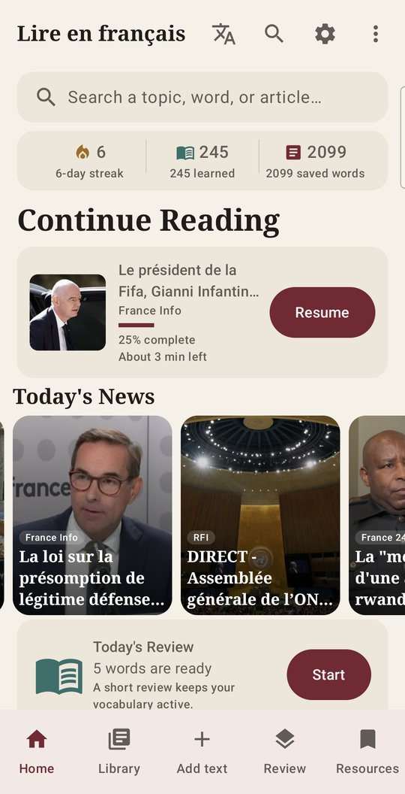
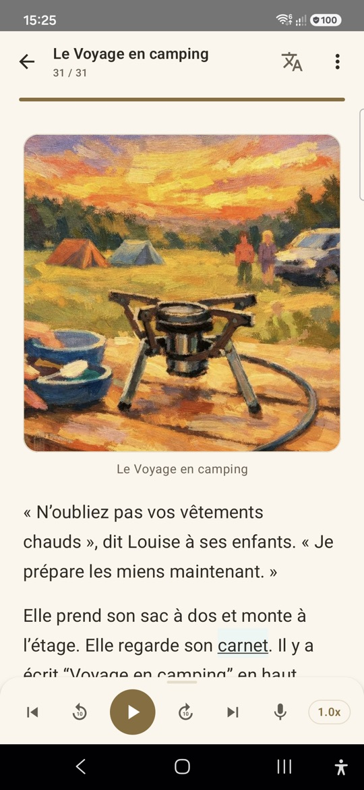
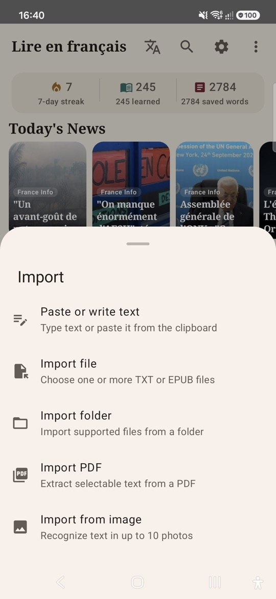
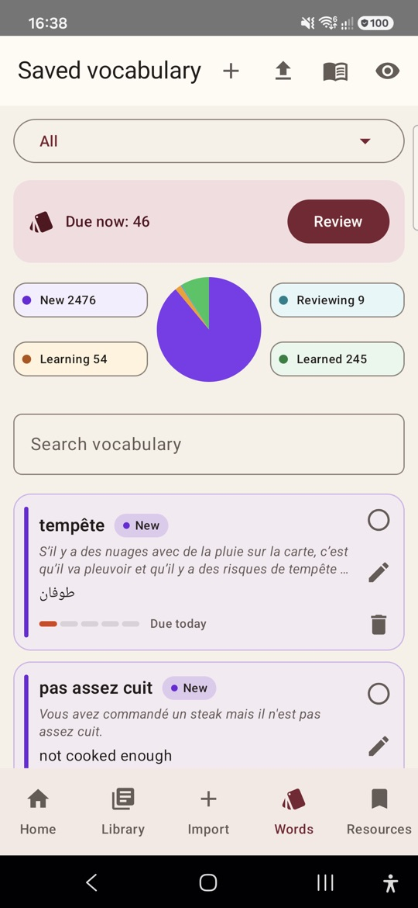
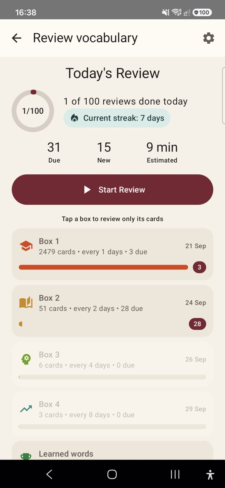
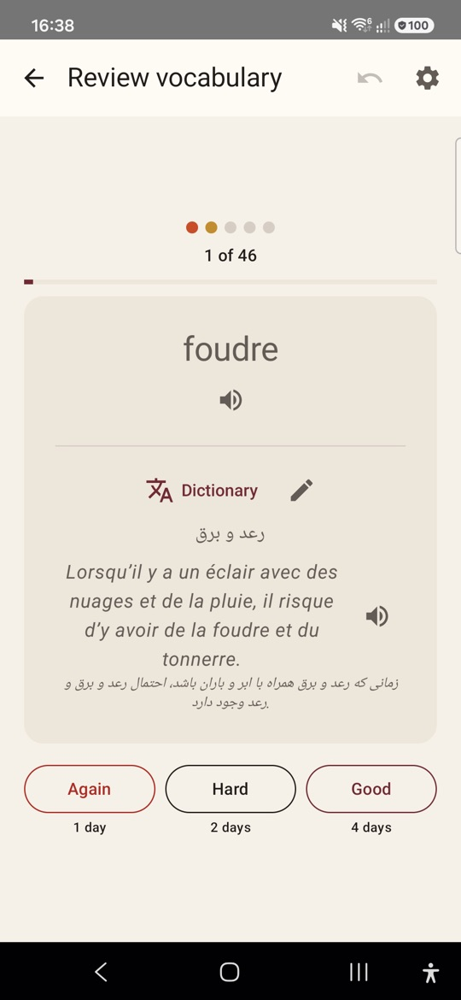

  <b>English</b> · <a href="README.fa.md">فارسی</a>

# French Reader

An Android app for learning French by reading: read real French texts, listen to them, look up words, and review the words you save.

## ⬇️ Download

  

1. On your Android phone, tap the **Download** button above. It always gets the newest version.
2. Open the downloaded file **FrenchReader.apk** (from your notifications or the **Downloads** folder).
3. If Android asks, allow installing apps from your browser or file manager, then tap **Install**.

Requires Android 8.0 or newer. To update later, download and install again: your words and texts are kept.

Older versions are on the [Releases page](https://github.com/Ziaeemehr/FrenchReaderSpike/releases).

## Screenshots

  
  
  

  
  
  

## Features

- **Read** French texts. Saved words are colored by how well you know them, and you can add your own colored highlights, show a translation under each paragraph, jump through long texts with a table of contents, and find words in the text.
- **Listen** with natural voices at the speed you choose; each sentence is highlighted as it is read and the page follows along.
- **Shadowing**: hear a sentence, hold the button and repeat it. The app checks how many words you said correctly and your pace, then shows a summary. Works offline, or with Android's speech recognition.
- **Look up** any word or phrase with a long press, and save it with its sentence.
- **Review** saved words with flashcards and spaced repetition (Leitner boxes), with audio for each card, a daily goal and a reminder.
- **Organize words** into decks: select several words to move or delete at once, tap a word to see its card, or import words from Anki or from a spreadsheet (CSV: word, meaning, sentence, deck; a sample file is available in the app).
- **Library** with folders and tags. Search looks inside the text itself (accents ignored) and opens the text at the match. Each text shows how much of its vocabulary you already know.
- **Import** texts from anywhere: paste, TXT/Markdown/EPUB files, a whole folder (with images), PDF, photos (text recognition), or share from another app.
- **Find content**: daily French news, graded stories and ready-made vocabulary decks.
- **Statistics**: daily streak, listening time, review activity and accuracy, shadowing scores, and texts and words saved.
- **Back up** to your phone or Google Drive.
- App in English, French or Persian.

## ⭐ Support

If French Reader helps you learn French, please give it a star on GitHub: it's free, and it helps other learners find the app.

## Privacy

See the [privacy policy](PRIVACY.md).

## For developers

Kotlin + Jetpack Compose. Build with `./gradlew :app:assembleRelease` (JDK 17, Android SDK).
